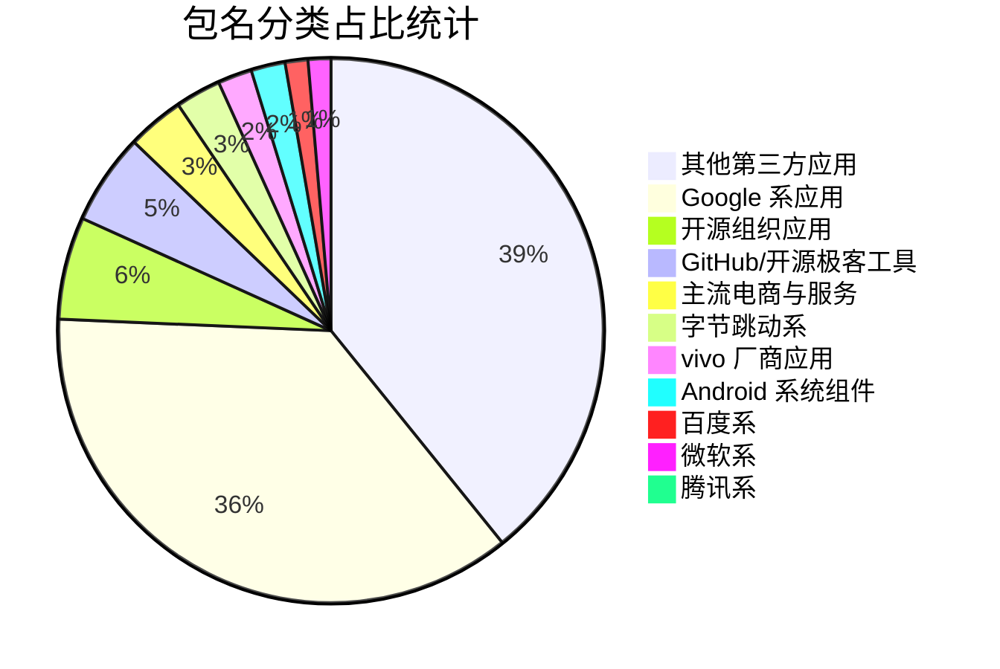

# Proc Alias 映射表管理与自动校验

维护 Android 应用包名（`Package Name`）到目录别名（`Alias`）的映射关系文件 `proc-alias.yaml`。

## 📁 文件说明

* `proc-alias.yaml`: 包名与别名映射表（修改此文件触发自动统计）。
* `check_proc_alias.py`: 云端自动检测与统计脚本。
* `.github/workflows/check-alias.yml`: GitHub Actions 云端工作流配置。

---

<!-- STATS_START -->
## 📊 包名数据可视化统计大屏

### 📈 概览
- **配置文件总行数**: `149` 条
- **独立有效应用数**: `149` 个
- **重复包名状态**: ✅ **校验通过 (无重复)**

### 🎨 应用分类分布饼图

### 📋 分类列表明细

<b>其他第三方应用</b> （包含 58 个应用）

| 包名 (Package Name) | 目录别名 (Alias) | 备注 |
| :--- | :--- | :--- |
| `ai.perplexity.app.android` | `perplexity` | Perplexity ✅ 修正：原com.perplexity.perplexity |
| `app.intra` | `intra` | Intra |
| `cn.wps.moffice_eng` | `wps-office` | WPS Office |
| `com.aliyun.tongyi` | `tongyi` | 千问 |
| `com.anthropic.claude` | `claude` | Claude |
| `com.apkpure.aegon` | `apkpure` | APKPure ✅ 修正：原com.apkpure.aframe |
| `com.bd.nproject` | `lemon8` | Lemon8 ✅ 修正：原com.lumi.lemon8 |
| `com.browser2345` | `browser2345` | 2345浏览器 |
| `com.cctv.yangshipin.app.androidp` | `yangshipin` | 央视频 |
| `com.coolapk.market` | `coolapk` | 酷安 |
| `com.ct.client` | `chinatelecom` | 中国电信 |
| `com.ddm.iptools` | `ip-tools` | IP Tools |
| `com.deepl.mobiletranslator` | `deepl` | DeepL ✅ 修正：多了点→连写 |
| `com.energy.weather` | `breezy-weather` | Breezy Weather ✅ 统一别名 |
| `com.fitbit.FitbitMobile` | `health-mobile` | Health ✅ 修正：原com.health.mobile |
| `com.hp.printercontrol` | `hp-smart` | HP |
| `com.huawei.smarthome` | `huawei-smarthome` | 智慧生活 |
| `com.icbc` | `icbc` | 中国工商银行 |
| `com.jincheng.supercaculator` | `super-calculator` | 全能计算器 ✅ 修正：故意少l→caculator |
| `com.kwai.video` | `kwai` | Kwai |
| `com.kwai.videoeditor` | `kwai-videoeditor` | 快影 |
| `com.larus.wolf` | `dola` | Dola(字节海外AI) ✅ 补充 |
| `com.lenovo.safecenter` | `lenovo-safecenter` | 联想智能设备安全组件 |
| `com.lonelycatgames.Xplore` | `x-plore` | X-plore |
| `com.lovebizhi.wallpaper` | `lovebizhi` | 爱壁纸 |
| `com.luna.music` | `luna-music` | 汽水音乐 |
| `com.meizu.flyme.calculator` | `meizu-calculator` | 魅族计算器 |
| `com.mmbox.xbrowser` | `xbrowser` | X浏览器 |
| `com.nasoft.socmark` | `socmark` | 手机性能排行 |
| `com.nebula.clashmi` | `clash-mi` | Clash Mi ✅ 补充 |
| `com.niksoftware.snapseed` | `snapseed` | Snapseed |
| `com.ookla.speedtest` | `speedtest` | Speedtest |
| `com.openai.chatgpt` | `chatgpt` | ChatGPT |
| `com.payoneer.mobile` | `payoneer` | Payoneer |
| `com.pikcloud.pikpak` | `pikpak` | PikPak网盘 ✅ 补充 |
| `com.pinterest` | `pinterest` | Pinterest ✅ 补充 |
| `com.pranavpandey.rotation` | `rotation` | Rotation |
| `com.rhmsoft.edit` | `quickedit` | QuickEdit |
| `com.sgcc.wsgw.cn` | `wsgw` | 网上国网 |
| `com.tailscale.ipn` | `tailscale` | Tailscale ✅ 补充 |
| `com.termux` | `termux` | Termux |
| `com.tiktok.lite.go` | `tiktok-lite` | TikTok Lite |
| `com.twitter.android` | `twitter` | Twitter / X |
| `com.v2ray.ang` | `v2rayng` | v2rayNG |
| `com.v2ray.ang.fdroid` | `v2rayng-fdroid` | v2rayNG(F-Droid版) ✅ 补充变体 |
| `com.waze` | `waze` | Waze 导航 |
| `com.wirelessalien.zipxtract` | `zipxtract` | ZipXtract ✅ 修正：saleri→alien |
| `com.xiaomi.smarthome` | `mijia` | 米家 |
| `com.xtc.originwidget` | `xtc-widget` | 小天才组件 ✅ 修正：少i→originwidget |
| `com.zhiliaoapp.musically` | `tiktok` | TikTok国际版 ✅ 修正+补充 |
| `com.zidongdianji` | `auto-clicker` | 自动点击器 |
| `com.zoho.notebook` | `zoho-notebook` | Notebook |
| `info.muge.appshare` | `appshare` | AppShare ✅ 修正：myapp→muge |
| `jp.ddo.hotmist.unicodepad` | `unicodepad` | UnicodePad ✅ 修正：pakutoma→hotmist |
| `mark.via.gp` | `via-browser` | Via浏览器 |
| `sz.szsmk.citizencard` | `szsmk` | 智慧苏州 |
| `tw.nekomimi.nekogram` | `nekogram` | Nekogram ✅ 补充 |
| `xxx.pornhub.fuck` | `javdb` | JavDB ✅ 修正：xio→xxx |

<b>Google 系应用</b> （包含 54 个应用）

| 包名 (Package Name) | 目录别名 (Alias) | 备注 |
| :--- | :--- | :--- |
| `com.google.android.GoogleCamera` | `google-camera` | Google 相机 |
| `com.google.android.apps.adm` | `google-find-my-device` | 查找我的设备 |
| `com.google.android.apps.bard` | `gemini` | Gemini |
| `com.google.android.apps.books` | `google-play-books` | Google Play 图书 |
| `com.google.android.apps.chromecast.app` | `google-home` | Google Home |
| `com.google.android.apps.classroom` | `google-classroom` | Google 课堂 |
| `com.google.android.apps.docs` | `google-drive` | Google 云端硬盘 |
| `com.google.android.apps.docs.editors.docs` | `google-docs` | Google 文档 |
| `com.google.android.apps.docs.editors.sheets` | `google-sheets` | Google 表格 |
| `com.google.android.apps.docs.editors.slides` | `google-slides` | Google 幻灯片 |
| `com.google.android.apps.dynamite` | `google-chat` | Google Chat |
| `com.google.android.apps.fitness` | `google-fit` | Google Fit |
| `com.google.android.apps.googleassistant` | `google-assistant` | Google 助理 |
| `com.google.android.apps.healthdata` | `health-connect` | 健康数据共享 |
| `com.google.android.apps.labs.language.tailwind` | `google-notebook` | Google笔记本 |
| `com.google.android.apps.magazines` | `google-news` | Google 新闻 |
| `com.google.android.apps.maps` | `google-maps` | 地图 |
| `com.google.android.apps.messaging` | `google-messages` | Google 信息 |
| `com.google.android.apps.nbu.files` | `google-files` | Google Files / 文件极客 |
| `com.google.android.apps.photos` | `google-photos` | Google 相册 |
| `com.google.android.apps.photosgo` | `photos-go` | 相册(Go版) |
| `com.google.android.apps.podcasts` | `google-podcasts` | Google 播客 |
| `com.google.android.apps.tachyon` | `google-meet` | Google Meet |
| `com.google.android.apps.tasks` | `google-tasks` | Google Tasks |
| `com.google.android.apps.translate` | `google-translate` | Google 翻译 |
| `com.google.android.apps.walletnfcrel` | `google-wallet` | Google 钱包 |
| `com.google.android.apps.wallpaper` | `google-wallpapers` | Google 壁纸 |
| `com.google.android.apps.wellbeing` | `digital-wellbeing` | 数字健康 |
| `com.google.android.apps.youtube.creator` | `youtube-studio` | YouTube Studio |
| `com.google.android.apps.youtube.kids` | `youtube-kids` | YouTube Kids |
| `com.google.android.apps.youtube.music` | `youtube-music` | YouTube Music |
| `com.google.android.as.oss` | `private-compute-services` | Private Compute Services ✅ 补全.oss |
| `com.google.android.authenticator` | `google-authenticator` | 身份验证器 |
| `com.google.android.calculator` | `google-calculator` | Google 计算器 |
| `com.google.android.calendar` | `google-calendar` | Google 日历 |
| `com.google.android.contactkeys` | `android-keyverifier` | Android密钥验证 ✅ 修正包名 |
| `com.google.android.contacts` | `google-contacts` | 通讯录 |
| `com.google.android.deskclock` | `google-clock` | Google 时钟 |
| `com.google.android.dialer` | `google-dialer` | 电话 |
| `com.google.android.gm` | `gmail` | Gmail |
| `com.google.android.gms` | `google-gms` | 谷歌服务 |
| `com.google.android.googlequicksearchbox` | `google-app` | Google搜索/助理 ✅ 建议更准确 |
| `com.google.android.ims` | `carrier-services` | Carrier Services |
| `com.google.android.inputmethod.latin` | `gboard` | Gboard |
| `com.google.android.keep` | `google-keep` | Google Keep 记事 |
| `com.google.android.play.games` | `google-play-games` | Google Play 游戏 |
| `com.google.android.projection.gearhead` | `android-auto` | Android Auto |
| `com.google.android.recorder` | `google-recorder` | Google 录音机 |
| `com.google.android.safetycore` | `android-safetycore` | Android System SafetyCore |
| `com.google.android.tts` | `google-tts` | Google 语音服务(TTS) |
| `com.google.android.videos` | `google-tv` | Google TV |
| `com.google.android.youtube` | `youtube` | YouTube |
| `com.google.ar.lens` | `google-lens` | 智能镜头 |
| `com.google.earth` | `google-earth` | Google 地球 |

<b>开源组织应用</b> （包含 9 个应用）

| 包名 (Package Name) | 目录别名 (Alias) | 备注 |
| :--- | :--- | :--- |
| `org.breezyweather` | `breezy-weather` | Breezy Weather |
| `org.chromium.webapk.a71da6c439749dd60_v2` | `google-pwa` | Google PWA ✅ 补充 |
| `org.chromium.webapk.ac00537baef003203_v2` | `wikipedia-pwa` | Wikipedia(PWA) ✅ 修正：org.wikipedia |
| `org.localsend.localsend_app` | `localsend` | LocalSend |
| `org.mozilla.firefox` | `firefox` | Firefox |
| `org.telegram.messenger` | `telegram` | Telegram |
| `org.torproject.torbrowser` | `tor-browser` | Tor Browser |
| `org.videolan.vlc` | `vlc` | VLC |
| `org.videolan.vlc.debug` | `vlc-debug` | VLC测试版 ✅ 补充变体 |

<b>GitHub/开源极客工具</b> （包含 8 个应用）

| 包名 (Package Name) | 目录别名 (Alias) | 备注 |
| :--- | :--- | :--- |
| `bin.mt.termex` | `mt-manager` | MT终端扩展包 ✅ 修正：原bin.mt.plus |
| `com.github.android` | `github` | GitHub |
| `com.github.nrfr` | `nrfr` | Nrfr |
| `io.github.InfinityLoop1309.NewPipeEnhanced` | `pipepipe` | PipePipe ✅ 修正：原com.pipepipe.app |
| `io.github.samolego.canta` | `canta` | Canta |
| `li.songe.gkd` | `gkd` | GKD |
| `moe.shizuku.privileged.api` | `shizuku` | Shizuku |
| `org.fdroid.fdroid` | `fdroid` | F-Droid |

<b>主流电商与服务</b> （包含 5 个应用）

| 包名 (Package Name) | 目录别名 (Alias) | 备注 |
| :--- | :--- | :--- |
| `com.eg.android.AlipayGphone` | `zhifubao` | 支付宝 |
| `com.sankuai.meituan` | `meituan` | 美团 |
| `com.taobao.idlefish` | `idlefish` | 闲鱼 |
| `com.taobao.taobao` | `taobao` | 淘宝 |
| `com.xunmeng.pinduoduo` | `pinduoduo` | 拼多多 |

<b>字节跳动系</b> （包含 4 个应用）

| 包名 (Package Name) | 目录别名 (Alias) | 备注 |
| :--- | :--- | :--- |
| `com.bytedance.android.ludao.online` | `ludao` | 笨包路人谈 |
| `com.ss.android.article.news` | `toutiao` | 头条搜索 |
| `com.ss.android.ugc.aweme` | `aweme` | 抖音 |
| `com.ss.android.ugc.trill` | `tiktok-in` | TikTok(印度/旧版) |

<b>vivo 厂商应用</b> （包含 3 个应用）

| 包名 (Package Name) | 目录别名 (Alias) | 备注 |
| :--- | :--- | :--- |
| `com.vivo.gallery` | `vivo-gallery` | vivo相册 |
| `com.vivo.remotemplugin` | `vivo-remote` | 客服协助 ✅ 修正：原com.vivo.remotepass |
| `com.vivo.sda` | `vivo-sda` | 售后诊断助手 ✅ 修正：原com.vivo.ada |

<b>Android 系统组件</b> （包含 3 个应用）

| 包名 (Package Name) | 目录别名 (Alias) | 备注 |
| :--- | :--- | :--- |
| `com.android.bbkcalculatos` | `vivo-calculator` | vivo计算器 ✅ 修正：原com.vivo.calculator |
| `com.android.chrome` | `chrome` | Chrome |
| `com.android.vending` | `google-play-store` | Google Play 商店 |

<b>百度系</b> （包含 2 个应用）

| 包名 (Package Name) | 目录别名 (Alias) | 备注 |
| :--- | :--- | :--- |
| `com.baidu.dict` | `baidu-dict` | 百度汉语 |
| `com.baidu.tieba` | `baidu-tieba` | 百度贴吧 |

<b>微软系</b> （包含 2 个应用）

| 包名 (Package Name) | 目录别名 (Alias) | 备注 |
| :--- | :--- | :--- |
| `com.microsoft.copilot` | `copilot` | Copilot |
| `com.microsoft.emmx` | `edge` | Edge |

<b>腾讯系</b> （包含 1 个应用）

| 包名 (Package Name) | 目录别名 (Alias) | 备注 |
| :--- | :--- | :--- |
| `com.tencent.mm` | `wechat` | 微信 |

<!-- STATS_END -->
