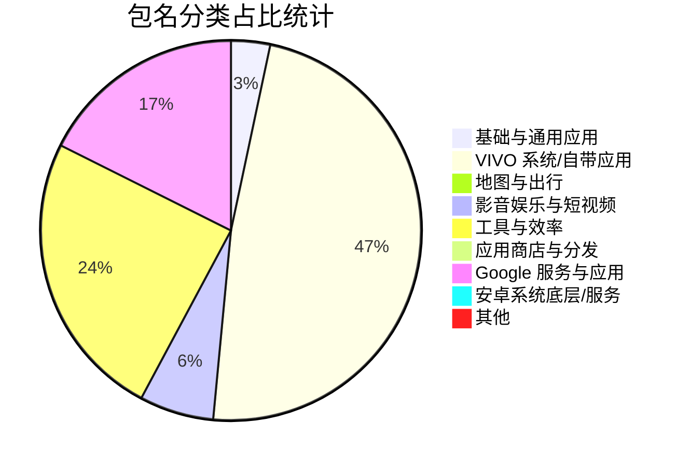

# Proc Alias 映射表管理与自动校验

维护 Android 应用包名（`Package Name`）到目录别名（`Alias`）的映射关系文件 `proc-alias.yaml`。

## 📁 文件说明

* `proc-alias.yaml`: 包名与别名映射表（修改此文件触发自动统计）。
* `check_proc_alias.py`: 云端自动检测与统计脚本。
* `.github/workflows/check-alias.yml`: GitHub Actions 云端工作流配置。

---

<!-- STATS_START -->
## 📊 包名映射统计

### 📈 概览
- **配置总条数**: `309` 条
- **独立应用数**: `309` 个
- **分类数**: `9` 个
- **校验状态**: ✅ 通过

### 🎨 应用分类分布

### 📋 分类明细

<b>基础与通用应用</b>(包含 10 个应用)

| 包名 | 目录别名 | 备注 |
| :--- | :--- | :--- |
| `com.eg.android.AlipayGphone` | `zhifubao` | 支付宝 |
| `com.luna.music` | `luna-music` | 汽水音乐 |
| `com.sankuai.meituan` | `meituan` | 美团 |
| `com.ss.android.ugc.aweme` | `aweme` | 抖音 |
| `com.taobao.idlefish` | `idlefish` | 闲鱼 |
| `com.taobao.taobao` | `taobao` | 淘宝 |
| `com.tencent.mm` | `wechat` | 微信 |
| `com.xunmeng.pinduoduo` | `pinduoduo` | 拼多多 |
| `mark.via.gp` | `via-browser` | Via浏览器 |
| `me.ele` | `eleme` | 饿了么 |

<b>VIVO 系统/自带应用</b>(包含 145 个应用)

| 包名 | 目录别名 | 备注 |
| :--- | :--- | :--- |
| `android.overlay.vivoresrro` | `vivo-res-overlay` | vivo资源覆盖层 |
| `com.android.bbkcalculator` | `vivo-calculator` | vivo计算器 官方版 |
| `com.android.bbkcalculatos` | `vivo-calculator-ver` | vivo计算器 修改版 |
| `com.android.bbksoundrecorder` | `vivo-tape-recorder` | vivo录音机 |
| `com.android.documentsui` | `vivo-file` | vivo文件 |
| `com.android.filemanager` | `vivo-file-management` | vivo文件管理 |
| `com.android.vivo.tws.vivotws` | `vivo-tws` | vivo TWS |
| `com.bbk.account` | `bbk-account` | vivo账号 |
| `com.bbk.theme.resources` | `wallpaper-res` | vivo壁纸资源 |
| `com.bbk.updater` | `bbk-system-upgrade` | vivo系统升级 |
| `com.iqoo.engineermode` | `vivo-gongchang-ceshi` | vivo工厂测试 |
| `com.iqoo.powersaving` | `vivo-battery` | vivo电池 |
| `com.iqoo.secure` | `vivo-shouji-guanjia` | vivo手机管家 |
| `com.vivo.SmartKey` | `quick-launch` | 快捷启动 |
| `com.vivo.abe` | `smart-engine` | 智慧引擎 |
| `com.vivo.accessibility` | `accessibility` | 无障碍 |
| `com.vivo.accessibilityenhance` | `accessibility-enhance` | 无障碍增强 |
| `com.vivo.agent` | `jovi-voice` | Jovi语音 |
| `com.vivo.ai.copilot` | `blueheart-v` | 蓝心小V |
| `com.vivo.aiengine` | `ai-engine` | 智慧服务 |
| `com.vivo.aiservice` | `ai-service` | AIService |
| `com.vivo.alldocuments` | `all-documents-viewer` | vivo万能查看器 |
| `com.vivo.alphacamera` | `alpha-camera` | AlphaCamera |
| `com.vivo.android.connectivity.mainline.common.resources.overlay` | `conn-common-overlay` | 连接通用覆盖层 |
| `com.vivo.android.connectivity.mainline.manufacturer.resources.overlay` | `connectivity-overlay` | 连接资源覆盖层 |
| `com.vivo.android.wifi.common.resources.overlay` | `wifi-common-overlay` | WiFi通用资源覆盖层 |
| `com.vivo.android.wifi.mainline.manufacturer.resources.overlay` | `wifi-mainline-overlay` | WiFi主线路覆盖层 |
| `com.vivo.android.wifi.mainline.platform.resources.overlay` | `wifi-mainline-platform-overlay` | WiFi主线平台覆盖层 |
| `com.vivo.android.wifi.manufacturer.resources.overlay` | `wifi-mfg-overlay` | WiFi厂商资源覆盖层 |
| `com.vivo.android.wifi.platform.resources.overlay` | `wifi-platform-overlay` | WiFi平台覆盖层 |
| `com.vivo.appfilter` | `pull-up-prevent-service` | 防拉起服务 |
| `com.vivo.assistant` | `important-notification` | 重要通知 |
| `com.vivo.audiofx` | `audio-effects` | 音效设置 |
| `com.vivo.base.player` | `system-audio-player` | 系统音频播放器 |
| `com.vivo.browser.novel.widget` | `vivo-browser` | vivo浏览器小说挂件 |
| `com.vivo.bsptest` | `bsp-test` | BSP测试 |
| `com.vivo.car.launcher` | `car-launcher` | 车载launcher |
| `com.vivo.car.networking` | `smart-car-networking` | 智能车载 |
| `com.vivo.card` | `super-card-wallet` | 超级卡包 |
| `com.vivo.cipherchain` | `cipher-vault` | 密码保险箱 |
| `com.vivo.compass` | `compass` | 指南针 |
| `com.vivo.connbase` | `multi-device-connect` | 多设备互联 |
| `com.vivo.connbase.sysui` | `control-center` | ControlCenter |
| `com.vivo.cota` | `cota` | COTA升级 |
| `com.vivo.countdownwidget` | `countdown-widget` | 计时器组件 |
| `com.vivo.daemonService` | `vivo-service-daemon` | vivo服务 |
| `com.vivo.defaultPlayer` | `default-player` | 视频播放器 |
| `com.vivo.desktopstickers` | `desktop-stickers` | 贴纸 |
| `com.vivo.devicepower` | `device-power` | 设备电量 |
| `com.vivo.devicereg` | `device-management` | 设备管理 |
| `com.vivo.doubleinstance` | `app-clone` | 应用分身 |
| `com.vivo.doubletimezoneclock` | `dual-clock-widget` | i挂件 |
| `com.vivo.easyshare` | `easyshare` | 互传 |
| `com.vivo.ese.widget` | `easy-mode-widget` | 简易模式小组件 |
| `com.vivo.faceui` | `face-ui` | FaceUI |
| `com.vivo.faceunlock` | `face-unlock` | 面部识别 |
| `com.vivo.familycare.local` | `familycare-local` | 健康使用设备 |
| `com.vivo.familycare.widget` | `family-care-widget` | 家庭关怀组件 |
| `com.vivo.favorite` | `favorite` | 收藏 |
| `com.vivo.findphone` | `find-phone` | 查找 |
| `com.vivo.fingerprint` | `fingerprint-unlock` | 指纹与密码 |
| `com.vivo.fingerprintui` | `fingerprint-ui` | 指纹UI组件 |
| `com.vivo.fingerprintvit` | `fingerprint-vit` | 指纹组件 |
| `com.vivo.floatingball` | `floating-ball` | 悬浮球 |
| `com.vivo.gallery` | `vivo-gallery` | vivo相册 |
| `com.vivo.gamecube` | `gamecube` | 游戏魔盒 |
| `com.vivo.gametrain` | `sound-position-train` | 听音辨位训练场 |
| `com.vivo.globalanimation` | `global-animation` | 全局动效 |
| `com.vivo.globalanimation.resources` | `global-animation-res` | 全局动画资源 |
| `com.vivo.globalsearch` | `global-search` | 全局搜索 |
| `com.vivo.health` | `vivo-health` | vivo健康 |
| `com.vivo.healthcode` | `health-code` | 健康码服务 |
| `com.vivo.healthservice` | `health-service` | 健康服务 |
| `com.vivo.healthwidget` | `health-widget` | 健康组件 |
| `com.vivo.hiboard` | `smart-desktop` | 智慧桌面 |
| `com.vivo.hybrid` | `quick-app-framework` | 快应用框架服务 |
| `com.vivo.iotserver` | `iot-engine` | IoT服务引擎 |
| `com.vivo.launchercopilot` | `blueheart-v-widget` | 蓝心小V组件 |
| `com.vivo.livewallpaper.box` | `live-wallpaper-box` | 动态壁纸盒子 |
| `com.vivo.magazine` | `lockscreen-magazine` | 阅图锁屏 |
| `com.vivo.minscreen` | `mini-screen` | 小屏 |
| `com.vivo.moodcube` | `morph-engine` | 变形器 |
| `com.vivo.motionrecognition` | `motion-recognition` | 智能体感 |
| `com.vivo.multinlp` | `location-service` | 定位服务 |
| `com.vivo.musicwidgetmix` | `atom-music-widget` | 原子随身听 |
| `com.vivo.networkimprove` | `network-improve` | 网络优化 |
| `com.vivo.networkstate` | `network-state` | 网络状态 |
| `com.vivo.nightpearl` | `night-pearl` | 熄屏显示 |
| `com.vivo.numbermark` | `number-mark` | 陌电识别 |
| `com.vivo.pay` | `multi-scene-secure-pay` | 多场景安全支付服务 |
| `com.vivo.pcsuite` | `pc-suite` | vivo办公套件 |
| `com.vivo.pem` | `power-guard` | 电量守护 |
| `com.vivo.permissionmanager` | `permission-manager` | 权限管理 |
| `com.vivo.phonehandoff` | `phone-handoff` | 通话接力 |
| `com.vivo.privacylauncher` | `privacy-launcher` | 隐私桌面 |
| `com.vivo.pushservice` | `push-service` | 推送引擎 |
| `com.vivo.quickpay` | `quick-pay` | 快捷支付 |
| `com.vivo.remotassistant` | `remote-assistant` | 远程协助 |
| `com.vivo.remotemplugin` | `vivo-remote` | 客服协助 |
| `com.vivo.safecenter` | `safe-center` | 安全中心 |
| `com.vivo.screenagent` | `v-note-helper` | 小V帮记 |
| `com.vivo.sda` | `vivo-sda` | 售后诊断助手 |
| `com.vivo.sdkplugin` | `service-secure-plugin` | vivo服务安全插件 |
| `com.vivo.seservice` | `digital-car-key` | 数字车钥匙服务 |
| `com.vivo.setupwizard` | `setup-wizard` | 开机引导 |
| `com.vivo.share` | `vivo-share` | vivo互传 |
| `com.vivo.sim.contacts` | `sim-contacts-service` | SIM卡联系人服务 |
| `com.vivo.simpleiconthemeres` | `simple-icon-theme-res` | 简约图标主题资源 |
| `com.vivo.singularity` | `vivo-webview` | vivo系统WebView |
| `com.vivo.smartanswer` | `smart-answer` | 电话秘书 |
| `com.vivo.smartmultiwindow` | `smart-multiwindow` | 多任务 |
| `com.vivo.smartshot` | `smart-screenshot` | 超级截屏 |
| `com.vivo.smartunlock` | `smart-unlock` | 智能解锁 |
| `com.vivo.sos` | `sos-emergency` | 紧急呼叫 |
| `com.vivo.sosappwidget` | `sos-widget` | SOS求助挂件 |
| `com.vivo.space` | `vivo-official-site` | vivo官网 |
| `com.vivo.sps` | `super-process-system` | SuperProcessSystem |
| `com.vivo.symmetry` | `vivo-camera` | vivo摄影 |
| `com.vivo.systemblur.server` | `system-blur-server` | SystemBlur |
| `com.vivo.systemuiplugin` | `system-ui-plugin` | 系统界面组件 |
| `com.vivo.third.numbermark` | `third-number-mark` | 陌生电话识别组件 |
| `com.vivo.translator` | `translator` | 翻译机 |
| `com.vivo.upnp.server` | `dlna-server` | 投屏 |
| `com.vivo.upslide` | `interaction-pool` | 交互池 |
| `com.vivo.vdfs` | `cross-device-share` | 跨设备使用 |
| `com.vivo.vhome` | `v-home` | VHome桌面 |
| `com.vivo.vhomeguide` | `v-home-guide` | VHome指引 |
| `com.vivo.vibrator4d` | `vibrator-4d` | 4D振感 |
| `com.vivo.video.floating` | `video-beauty` | 视频通话美颜 |
| `com.vivo.video.widget` | `video-widget` | 视频小组件 |
| `com.vivo.videoservice` | `video-editor` | 视频编辑 |
| `com.vivo.vivo3rdalgoservice` | `image-algo-service` | ImageAlgoService |
| `com.vivo.vms` | `vivo-mobile-service` | vivo移动服务 |
| `com.vivo.voicerecognition` | `voice-recognition` | 声音识别 |
| `com.vivo.voicewakeup` | `voice-wakeup` | 语音唤醒 |
| `com.vivo.vtouch` | `scan-assistant` | 扫描 |
| `com.vivo.wallet` | `vivo-wallet` | vivo钱包 |
| `com.vivo.wallet.appwidget` | `wallet-widget` | vivo钱包挂件 |
| `com.vivo.weather.provider` | `weather-provider` | 天气存储 |
| `com.vivo.widget.calendar` | `calendar-widget` | 日历组件 |
| `com.vivo.widget.cleanspeed` | `clean-speed` | 清理加速组件 |
| `com.vivo.widget.healthcare` | `healthcare-widget` | 健康关怀 |
| `com.vivo.widget.iot` | `iot-widget` | IoT智能设备挂件 |
| `com.vivo.xspace` | `atom-privacy-system` | 原子隐私系统 |
| `com.yozo.vivo.office` | `vivo-document` | vivo文档 |

<b>地图与出行</b>(包含 3 个应用)

| 包名 | 目录别名 | 备注 |
| :--- | :--- | :--- |
| `com.autonavi.minimap` | `amap` | 高德地图 |
| `com.baidu.BaiduMap` | `baidu-map` | 百度地图 |
| `com.waze` | `waze` | Waze导航 |

<b>影音娱乐与短视频</b>(包含 19 个应用)

| 包名 | 目录别名 | 备注 |
| :--- | :--- | :--- |
| `InfinityLoop1309.NewPipeEnhanced` | `newpipe-enhanced` | NewPipe增强版 |
| `ab16.Tuozi` | `tuozi-video` | 兔子视频 |
| `com.cctv.yangshipin.app.androidp` | `yangshipin` | 央视频 |
| `com.kaixinkan.ugc.video.atom` | `kaixinkan` | 开心看 |
| `com.kwai.video` | `kwai` | Kwai |
| `com.kwai.videoeditor` | `kwai-videoeditor` | 快影 |
| `com.layaboxhmhz.gamehmhz.okys` | `ok-player` | ok影视pro |
| `com.pinterest` | `pinterest` | Pinterest |
| `com.player.ku9` | `ku9-player` | 酷9影院 |
| `com.smile.gifmaker` | `kuaishou` | 快手 |
| `com.ss.android.article.news` | `toutiao` | 头条搜索 |
| `com.ss.android.ugc.trill` | `tiktok-in` | TikTok(印度/旧版) |
| `com.tiktok.lite.go` | `tiktok-lite` | TikTok Lite |
| `com.twitter.android` | `twitter` | Twitter / X |
| `com.xlkj.international.sunri` | `sunri-intl` | 旭日国际 |
| `com.zhiliaoapp.musically` | `tiktok` | TikTok国际版 |
| `io.github.InfinityLoop1309.NewPipeEnhanced` | `pipepipe` | PipePipe |
| `org.telegram.messenger` | `telegram` | Telegram |
| `tw.nekomimi.nekogram` | `nekogram` | Nekogram |

<b>工具与效率</b>(包含 74 个应用)

| 包名 | 目录别名 | 备注 |
| :--- | :--- | :--- |
| `ai.perplexity.app.android` | `perplexity` | Perplexity |
| `bin.mt.plus` | `mt-file-manager` | MT文件管理器 |
| `bin.mt.termex` | `mt-terminal-extension-pack` | MT终端扩展包 |
| `cn.com.omronhealthcare.omronplus.vivo` | `omron-health` | 欧姆龙健康vivo定制版 |
| `cn.wps.moffice_eng` | `wps-office` | WPS Office |
| `com.aliyun.tongyi` | `tongyi` | 千问 |
| `com.android.chrome` | `chrome` | Chrome |
| `com.anthropic.claude` | `claude` | Claude |
| `com.appshub.bettbox` | `bettbox` | BettBox应用库 |
| `com.baidu.dict` | `baidu-dict` | 百度汉语 |
| `com.baidu.tieba` | `baidu-tieba` | 百度贴吧 |
| `com.browser2345` | `browser2345` | 2345浏览器 |
| `com.bytedance.android.doubaoime` | `doubao-Keyboard` | 豆包输入法 |
| `com.coolapk.market` | `coolapk` | 酷安 |
| `com.ct.client` | `chinatelecom` | 中国电信 |
| `com.ddm.iptools` | `ip-tools` | IP Tools |
| `com.deepl.mobiletranslator` | `deepl` | DeepL |
| `com.fitbit.FitbitMobile` | `health-mobile` | 健康数据 |
| `com.github.android` | `github` | GitHub |
| `com.github.nrfr` | `nrfr` | Nrfr |
| `com.google.android.apps.healthdata` | `health-connect` | 健康数据共享 |
| `com.hp.printercontrol` | `hp-smart` | HP打印服务 |
| `com.huawei.smarthome` | `huawei-smarthome` | 智慧生活 |
| `com.icbc` | `icbc` | 中国工商银行 |
| `com.jincheng.supercaculator` | `super-calculator` | 全能计算器 |
| `com.larus.wolf` | `dola` | Dola(字节海外AI) |
| `com.lenovo.safecenter` | `lenovo-safecenter` | 联想安全组件 |
| `com.lonelycatgames.Xplore` | `x-plore` | X-plore |
| `com.lovebizhi.wallpaper` | `lovebizhi` | 爱壁纸 |
| `com.meizu.flyme.calculator` | `meizu-calculator` | 魅族计算器 |
| `com.microsoft.copilot` | `copilot` | Copilot |
| `com.microsoft.emmx` | `edge` | Edge |
| `com.miui.calculator` | `miui-calc` | 小米计算器 |
| `com.mmbox.xbrowser` | `xbrowser` | X浏览器 |
| `com.nasoft.socmark` | `socmark` | 手机性能排行 |
| `com.nebula.clashmi` | `clash-mi` | Clash Mi |
| `com.niksoftware.snapseed` | `snapseed` | Snapseed修图 |
| `com.ookla.speedtest` | `speedtest` | Speedtest测速 |
| `com.openai.chatgpt` | `chatgpt` | ChatGPT |
| `com.payoneer.android` | `payoneer` | Payoneer跨境支付 |
| `com.payoneer.mobile` | `payoneer` | 派安盈 |
| `com.pikcloud.pikpak` | `pikpak` | PikPak网盘 |
| `com.pranavpandey.rotation` | `rotation` | 旋转控制 |
| `com.rhmsoft.edit` | `quickedit` | QuickEdit编辑器 |
| `com.sgcc.wsgw.cn` | `wsgw` | 网上国网 |
| `com.tailscale.ipn` | `tailscale` | Tailscale |
| `com.termux` | `termux` | Termux终端 |
| `com.tumuyan.ncnn.realsr` | `real-sr` | RealSR图像超分 |
| `com.unionpay.tsmservice` | `unionpay-tsm` | 银联安全支付服务 |
| `com.v2ray.ang` | `v2rayng` | v2rayNG |
| `com.v2ray.ang.fdroid` | `v2rayng-fdroid` | v2rayNG(F-Droid版) |
| `com.wirelessalien.zipxtract` | `zipxtract` | ZipXtract解压 |
| `com.xiaomi.smarthome` | `mijia` | 米家 |
| `com.xtc.originwidget` | `xtc-widget` | 小天才组件 |
| `com.zidongdianji` | `auto-clicker` | 自动点击器 |
| `com.zoho.notebook` | `zoho-notebook` | Notebook |
| `info.muge.appshare` | `appshare` | AppShare |
| `io.github.samolego.canta` | `canta` | Canta |
| `jp.co.toshiba.android.FlashAir` | `flashair-tool` | 东芝FlashAir工具 |
| `jp.ddo.hotmist.unicodepad` | `unicodepad` | UnicodePad |
| `li.songe.gkd` | `gkd` | GKD |
| `moe.shizuku.privileged.api` | `shizuku` | Shizuku |
| `org.breezyweather` | `breezy-weather` | Breezy Weather |
| `org.breezyweather.oneui2iconprovider` | `breezy-oneui2` | 天气图标包OneUI2版 |
| `org.breezyweather.pixeliconprovider` | `breezy-pixel` | 天气图标包Pixel版 |
| `org.chromium.webapk.a71da6c439749dd60_v2` | `google-pwa` | Google PWA |
| `org.chromium.webapk.ac00537baef003203_v2` | `wikipedia-pwa` | Wikipedia(PWA) |
| `org.fdroid.fdroid` | `fdroid` | F-Droid |
| `org.localsend.localsend_app` | `localsend` | LocalSend |
| `org.mozilla.firefox` | `firefox` | Firefox |
| `org.torproject.torbrowser` | `tor-browser` | Tor浏览器 |
| `org.videolan.vlc` | `vlc` | VLC |
| `org.videolan.vlc.debug` | `vlc-debug` | VLC测试版 |
| `sz.szsmk.citizencard` | `szsmk` | 智慧苏州 |

<b>应用商店与分发</b>(包含 2 个应用)

| 包名 | 目录别名 | 备注 |
| :--- | :--- | :--- |
| `com.android.vending` | `google-play-store` | Google Play商店 |
| `com.apkpure.aegon` | `apkpure` | APKPure |

<b>Google 服务与应用</b>(包含 53 个应用)

| 包名 | 目录别名 | 备注 |
| :--- | :--- | :--- |
| `com.google.android.GoogleCamera` | `google-camera` | Google相机 |
| `com.google.android.apps.adm` | `google-find-my-device` | 查找我的设备 |
| `com.google.android.apps.bard` | `gemini` | Gemini |
| `com.google.android.apps.books` | `google-play-books` | Google Play图书 |
| `com.google.android.apps.chromecast.app` | `google-home` | Google Home |
| `com.google.android.apps.classroom` | `google-classroom` | Google课堂 |
| `com.google.android.apps.docs` | `google-drive` | Google云端硬盘 |
| `com.google.android.apps.docs.editors.docs` | `google-docs` | Google文档 |
| `com.google.android.apps.docs.editors.sheets` | `google-sheets` | Google表格 |
| `com.google.android.apps.docs.editors.slides` | `google-slides` | Google幻灯片 |
| `com.google.android.apps.dynamite` | `google-chat` | Google Chat |
| `com.google.android.apps.fitness` | `google-fit` | Google Fit |
| `com.google.android.apps.googleassistant` | `google-assistant` | Google助理 |
| `com.google.android.apps.labs.language.tailwind` | `google-notebook` | Google笔记本 |
| `com.google.android.apps.magazines` | `google-news` | Google新闻 |
| `com.google.android.apps.maps` | `google-maps` | Google地图 |
| `com.google.android.apps.messaging` | `google-messages` | Google信息 |
| `com.google.android.apps.nbu.files` | `google-files` | Google文件/文件极客 |
| `com.google.android.apps.photos` | `google-photos` | Google相册 |
| `com.google.android.apps.photosgo` | `photos-go` | 相册Go版 |
| `com.google.android.apps.podcasts` | `google-podcasts` | Google播客 |
| `com.google.android.apps.tachyon` | `google-meet` | Google Meet |
| `com.google.android.apps.tasks` | `google-tasks` | Google Tasks |
| `com.google.android.apps.translate` | `google-translate` | Google翻译 |
| `com.google.android.apps.walletnfcrel` | `google-wallet` | Google钱包 |
| `com.google.android.apps.wallpaper` | `google-wallpapers` | Google壁纸 |
| `com.google.android.apps.wellbeing` | `digital-wellbeing` | 数字健康 |
| `com.google.android.apps.youtube.creator` | `youtube-studio` | YouTube Studio |
| `com.google.android.apps.youtube.kids` | `youtube-kids` | YouTube Kids |
| `com.google.android.apps.youtube.music` | `youtube-music` | YouTube Music |
| `com.google.android.as.oss` | `private-compute-services` | Private Compute Services |
| `com.google.android.authenticator` | `google-authenticator` | 身份验证器 |
| `com.google.android.calculator` | `google-calculator` | Google计算器 |
| `com.google.android.calendar` | `google-calendar` | Google日历 |
| `com.google.android.contactkeys` | `android-keyverifier` | Android密钥验证 |
| `com.google.android.contacts` | `google-contacts` | 通讯录 |
| `com.google.android.deskclock` | `google-clock` | Google时钟 |
| `com.google.android.dialer` | `google-dialer` | 电话 |
| `com.google.android.gm` | `gmail` | Gmail |
| `com.google.android.gms` | `google-gms` | 谷歌服务 |
| `com.google.android.googlequicksearchbox` | `google-app` | Google搜索/助理 |
| `com.google.android.ims` | `carrier-services` | Carrier Services |
| `com.google.android.inputmethod.latin` | `gboard` | Gboard输入法 |
| `com.google.android.keep` | `google-keep` | Google Keep记事 |
| `com.google.android.play.games` | `google-play-games` | Google Play游戏 |
| `com.google.android.projection.gearhead` | `android-auto` | Android Auto |
| `com.google.android.recorder` | `google-recorder` | Google录音机 |
| `com.google.android.safetycore` | `android-safetycore` | Android安全核心 |
| `com.google.android.tts` | `google-tts` | Google语音服务TTS |
| `com.google.android.videos` | `google-tv` | Google TV |
| `com.google.android.youtube` | `youtube` | YouTube |
| `com.google.ar.lens` | `google-lens` | 智能镜头 |
| `com.google.earth` | `google-earth` | Google地球 |

<b>安卓系统底层/服务</b>(包含 2 个应用)

| 包名 | 目录别名 | 备注 |
| :--- | :--- | :--- |
| `app.intra` | `intra` | Intra DNS防污染 |
| `com.android.vendors.bridge.softsim` | `b-sim` | 虚拟SIM相关 |

<b>其他</b>(包含 1 个应用)

| 包名 | 目录别名 | 备注 |
| :--- | :--- | :--- |
| `xxx.pornhub.fuck` | `javdb` | JavDB |

<!-- STATS_END -->
